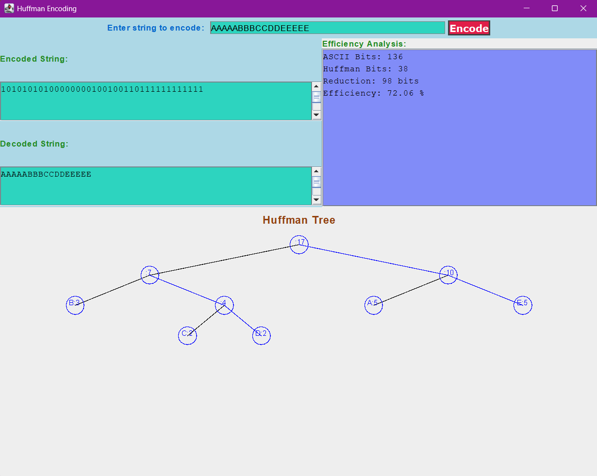

# Huffman Encoding Application

## Overview

This project implements a **Huffman Coding algorithm** to compress and decompress text. The application includes a user-friendly **Graphical User Interface (GUI)** built with Java Swing, providing features for encoding strings, visualizing the Huffman tree, and analyzing the efficiency of the compression.

Huffman Coding is a lossless data compression algorithm that uses variable-length binary codes to represent characters, optimizing the storage of text by assigning shorter codes to more frequently used characters.

---

## Features

### Core Features
- **Encoding**: Converts a given string into its Huffman-encoded binary representation.
- **Decoding**: Reconstructs the original string from the encoded binary sequence.
- **Tree Visualization**: Displays the Huffman tree structure used for encoding.
- **Efficiency Analysis**: Calculates and displays metrics such as:
  - ASCII bit usage
  - Huffman bit usage
  - Bit reduction
  - Compression efficiency percentage

### Graphical Interface
- Input field for entering text to encode.
- Panels to display encoded and decoded text.
- A dedicated section for efficiency metrics.
- Interactive visualization of the Huffman tree.

---


### File Descriptions

- **Main.java**: The main entry point of the program. It initializes the GUI, handles user input, and coordinates encoding, decoding, and tree visualization.
- **HuffmanCoder.java**: Implements the Huffman Coding algorithm. Handles tree construction, encoding, and decoding logic.
- **Heap.java**: A min-heap implementation used as a priority queue for constructing the Huffman tree.
- **TreePanel.java**: A custom Swing component for drawing the Huffman tree in the GUI.

---

## Requirements

### For Running the Application
- **Java Runtime Environment (JRE)** 8 or later.

### For Building the Application
- **Java Development Kit (JDK)** 8 or later.
- A build tool like `javac` or an IDE (e.g., IntelliJ IDEA, Eclipse).

---

## Installation

### Cloning the Repository

1. Open your terminal and clone the repository:

   ```bash
   git clone https://github.com/eizadhamdan/huffman_coding_project.git
2. Navigate into the project directory:

   ```bash
   cd huffman_coding_project

## Running the Application

### Using Pre-Built Executable
1. Download the `.jar` file.
2. Run the program by double-clicking the `.jar` file or using the terminal:
   ```bash
   java -jar HuffmanApp.jar

### Without Pre-Built Executable
1. Compile the source files:
   ```bash
   javac *.java
2. Run the program:
   ```bash
   java Main

## Example Usage

### Steps:

1. **Input**: Enter a string in the input field.
2. **Encode**: Click the "Encode" button to compress the string.
3. **Output**:
   - Encoded binary string
   - Decoded original string
   - Efficiency analysis (bits saved and compression ratio)
4. **Visualization**: View the Huffman tree structure in the tree panel.

## Example Pictures


<br />

